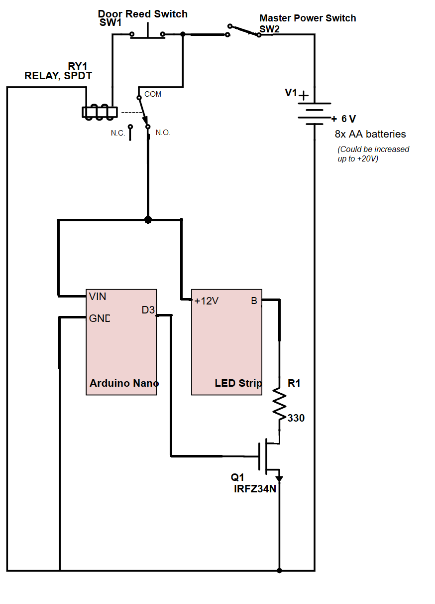

# IEEE_LED_Sign
This is the material for an LED sign for the IEEE uOttawa branch office.   We wanted a way for people at the other end of the (very long) hallway to be able to see if someone was in the office or not.

When the door is open (meaning someone's in the office), the sign blinks out "IEEE" in morse code in blue.  When the door is closed, the lights stay off.  I made this with [@PirateRoberts98](https://github.com/PirateRoberts98) using some LED strips, an Arduino Nano, a relay, a magnetic reed switch, a MOSFET (to fade the lights), and copious amounts of solder.

## Wiring diagram

